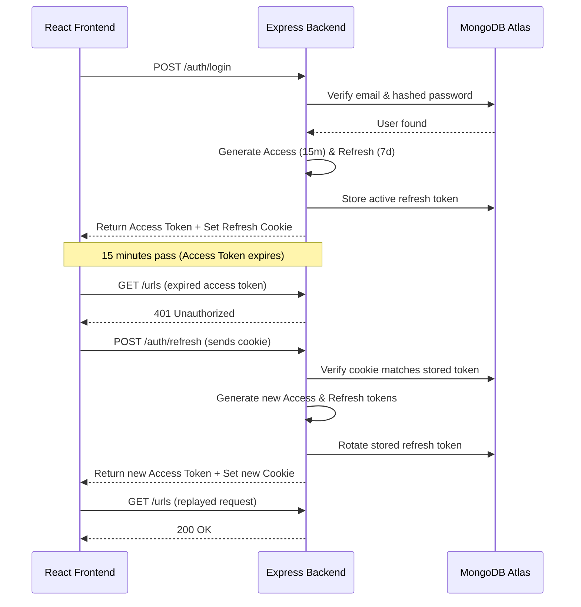
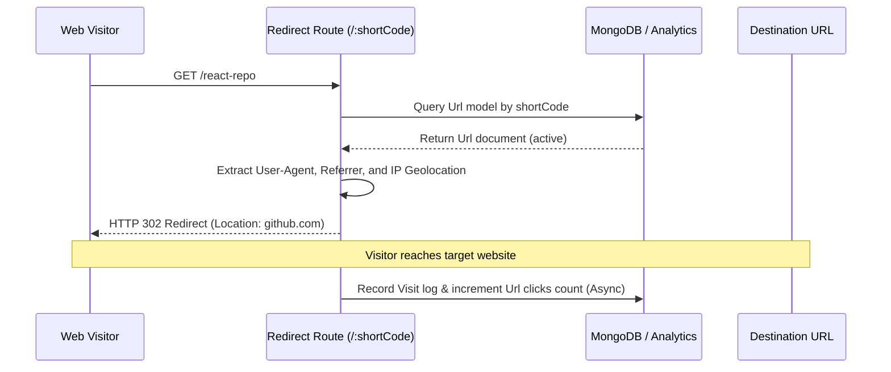
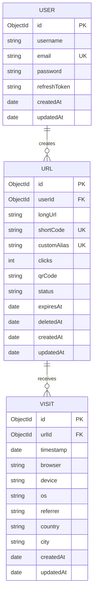

# Architecture Documentation

This document explains the technical architecture, database schemas, flowcharts, and design principles implemented in the URL Shortener & Analytics platform.

---

## 1. High-Level System Architecture

The application is structured as a decoupled monorepo containing a React frontend client and an Express.js backend API server. In production, they can be deployed separately or packaged together inside a single Docker container.

```mermaid
graph TD
    Client[React/Vite Client] -- "JSON API requests" --> ExpressServer[Express.js Server]
    ExpressServer -- "Mongoose ODM" --> MongoDB[MongoDB Atlas Database]
    ExpressServer -- "Cache (Optional)" --> Redis[Redis Cache Cluster]
    Client -- "Direct Redirect Link" --> ShortCodeRoute[/:shortCode]
    ShortCodeRoute -- "Capture user-agent, geo, referrer" --> ExpressServer
```

---

## 2. Low-Level Module Design (Backend)

The backend follows the MVC (Model-View-Controller) design pattern and incorporates a business logic Service Layer to thin out controllers:

- **Routes**: Define paths, rate limiters, validation middlewares, and bind request context to controllers.
- **Controllers**: Parse input arguments, call appropriate services, and output standardized responses (`sendSuccess` / `sendError`).
- **Services**: Centralize core business rules:
  - `AuthService`: Password hashing, session creation, token rotation.
  - `UrlService`: URL formatting validations, custom alias checks, unique short code creation, QR Code generation.
  - `AnalyticsService`: User Agent parsing, IP-to-Geo resolutions, visit logging, timeseries analytics aggregations.
- **Models**: Define Mongo schemas with Mongoose and define optimal database indices.

---

## 3. Core Operational Flows

### A. JWT Authentication & Refresh Token Rotation

To ensure high security without forcing users to re-login frequently, we implement Token Rotation:
1. When logging in, the server issues an **Access Token** (expires in 15 mins) in the JSON body, and a **Refresh Token** (expires in 7 days) inside a secure `httpOnly` cookie.
2. The client attaches the Access Token to the `Authorization` header of all requests.
3. When the Access Token expires, the client's Axios Interceptor catches the `401 Unauthorized` response, issues a `POST /api/v1/auth/refresh` request (transmitting the refresh cookie), receives a new token pair, and replays the original failed request.



### B. URL Redirection & Analytics Capture Flow

Redirections must execute instantly. Visitor logging runs asynchronously in the background.



---

## 4. Database Schema Relationships



---

## 5. Security Measures

1. **Password Protection**: Hashing using `bcryptjs` with 10 salt rounds.
2. **HTTP Header Protection**: Integrated `helmet` middleware.
3. **CORS Configuration**: Restricts origin requests to authorized host domains.
4. **Rate Limiting**: Custom limits prevent login brute-forcing and URL creations loops.
5. **Database Auditing**: Automatically tracks mutations with `timestamps: true` audits.
6. **Soft Deletions**: Protects database referential integrity by flagging deleted links instead of erasing database rows.
7. **Destination Loop Protection**: Filters out localhost loopbacks, internal subnet IPs, and non-HTTP/HTTPS protocols.
